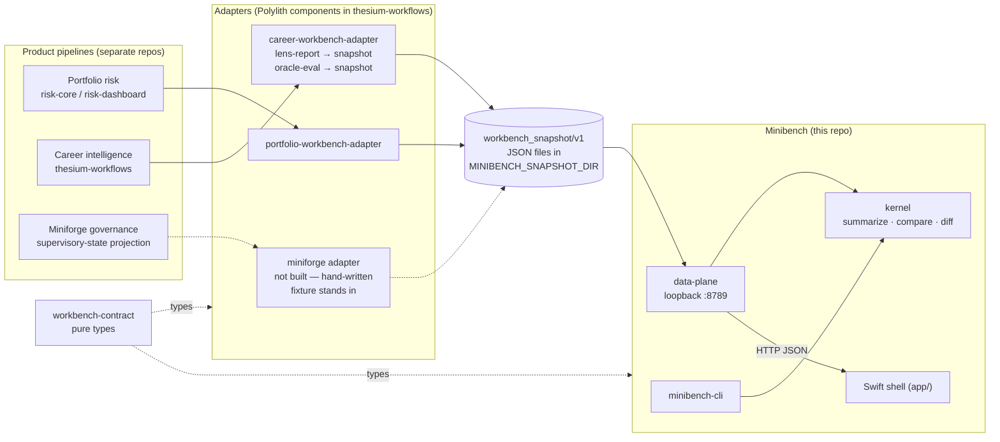
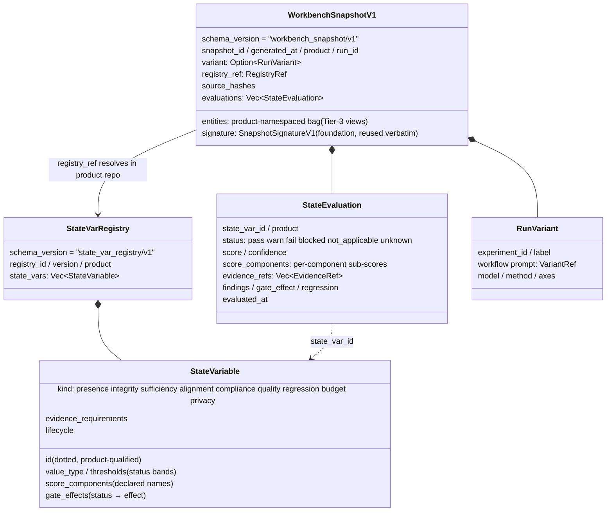
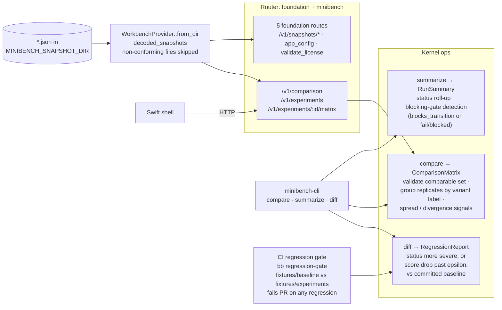
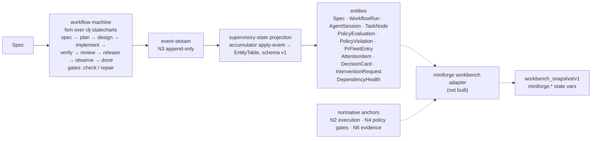
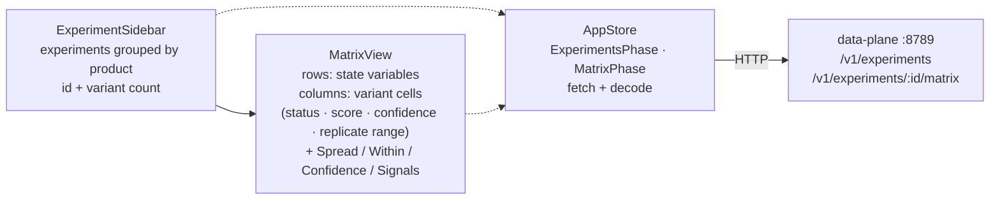

# Architecture

How tenant products feed `workbench_snapshot/v1` bodies into the
workbench, what the kernel does with them, and where the seams sit.

Redrawn 2026-07-19 from the implementation. Supersedes the
pre-implementation bootstrap sketches (the 2026-06-06
"thesium-miniforge-workbench-bootstrap" bundle); §6 records what changed
between that sketch and what shipped. Career-pipeline internals live in
`thesium-workflows/docs/design/career-pipeline-architecture.md`, not
here — this doc stops at the adapter seam.

All diagrams are Mermaid fences, rendered natively by GitHub. Edit them
in place; no generated images are checked in, so nothing can go stale
silently.

## 1. System context

Products never link minibench and minibench never links a product crate.
The seam is `workbench-contract` (pure types, Rust canonical, Clojure
Malli mirror for adapters) plus snapshot JSON on disk and HTTP on
loopback.

There is no plugin registration. A product joins by emitting a snapshot
whose `product` and `registry_ref` are self-describing; the data plane
groups snapshots by `variant.experiment_id` and the sidebar groups by
`product`. Tenants today: portfolio (live adapter output), career (live
adapter output via `bb workbench:*`), miniforge (hand-written fixture;
adapter not built), time (named in the README, unstarted).

Minibench is the third consumer of `thesium-app-foundation` (after risk
`:8787` and career `:8788`) — same foundation router, loopback `:8789`.

## 2. Contract anatomy

Canonical source: `workbench-contract/crates/contracts/src/lib.rs`. The
registry lives in the product repo; the snapshot carries only a
`RegistryRef`. Scoring happens in the adapter before the snapshot
exists.

Snapshots sharing `variant.experiment_id` form one comparison set — the
run matrix.

## 3. Snapshot flow and kernel operations

The kernel never scores. It rolls up, compares, and diffs snapshots that
arrive pre-scored. The registry is an optional yardstick: `summarize`
resolves canonical gate effects from `StateVariable.gate_effects`
instead of trusting a possibly-stale `evaluation.gate_effect`, and
`compare` uses `StateVariable.thresholds` band widths to flag
meaningful score spread. It is never a scoring engine.

The regression gate is the loop the workbench exists to close: it does
not just measure, it gates. Accepting a new result means updating
`fixtures/baseline/`.

## 4. Tenant grounding

| Tenant | Registry | State vars | Feed |
|---|---|---|---|
| portfolio | `portfolio-state-vars` | `portfolio.lens.validation_readiness`, `portfolio.signal.quality_scored`, `portfolio.data.fidelity_gate` | live adapter output |
| career | `career-state-vars` @ 2026.06.06.1 | `career.lens.report_grounded`, `career.lens.evidence_sufficiency`, `career.claim.evidence_traceability`, `career.oracle.reproduction_delta` | live adapter output (`bb workbench:*` in thesium-workflows) |
| miniforge | `miniforge-state-vars` | `miniforge.workflow.machine_authoritative`, `miniforge.evidence.bundle_complete`, `miniforge.gate.critical_violations_block` | hand-written `fixtures/sample-snapshot.json`; adapter not built |
| time | — | — | named only, unstarted |

The miniforge tenant grounds in the supervisory-state projection and the
N-series normative anchors (N2 execution machine, N4 policy gates, N6
evidence). What the future adapter will project:

Stale-sketch note: `EvidenceBundle` and budget records still exist in
miniforge (live component; phase-config `Budget`) but are no longer
first-class supervisory-state entities, so they no longer appear on the
projection spine.

## 5. Shell information architecture

Single macOS window, two-pane `NavigationSplitView`. The Rust/Swift seam
is HTTP on loopback, not FFI; the kernel runs server-side.

Signal chips: `single run`, `between`, `within noise`, `status`,
`meaningful`, `coverage`, `unstable`. Loading/empty/failure render as
phase states in the same window, not separate screens.

Deferred shell tiers: the experiment picker, the shared primitive kit,
and per-tenant bespoke view plugins. The contract already carries the
plugin declaration (`ViewPlugin`, tiers generic / primitive / bespoke,
`consumes` naming the entity-bag namespaces a bespoke view reads).

## 6. What changed between the bootstrap sketch and the implementation

The June bootstrap bundle drew a workbench that evaluates; what shipped
is a workbench that compares and gates, with evaluation pushed out to
the product adapters.

| Bootstrap sketch (2026-06-06) | Implementation |
|---|---|
| Kernel runs deterministic / semantic / LLM evaluators over snapshots | Adapters score in the product repo; kernel only summarizes, compares, diffs |
| State-variable registry drives evaluator dispatch | Registry is an optional yardstick: canonical gate effects, threshold band widths |
| Bounded LLM narration inside the workbench | Not built; narration-packet assembly deferred |
| Broad multi-view UI (registry browser, evidence chain, correction queue, per-tenant boards) | One window: sidebar + comparison matrix; the rest deferred |
| Shared local evidence store between products and workbench | File-drop snapshot dir + loopback HTTP; no shared store |
| Four tenants live | portfolio + career live; miniforge fixture stand-in; time unstarted |

Invariants that survived: products own scoring and evidence; the
workbench owns comparison and regression; every snapshot is versioned
(`workbench_snapshot/v1`) and diffable; the regression gate fails CI on
any status/score regression.
